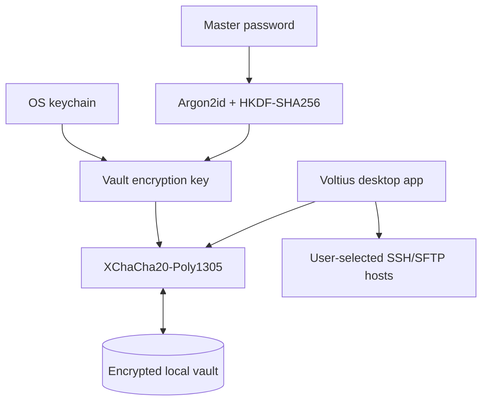

<div align="center">
  
  <br/>
  <h1>Voltius</h1>
  
  <p><strong>A local-first SSH/SFTP/Serial client with plugins and no account required — a modern alternative to Termius.</strong></p>
  
  <p>
    <a href="https://github.com/VoltiusApp/voltius/releases/latest"></a>
    
    
    
    
    
    <a href="https://docs.voltius.app"></a>
    
  </p>

  
</div>

---

## ✨ Features

No account required. Your Voltius data stays local to this device unless you explicitly export it.

> **Canonical product docs:** [Feature catalog](docs/features.md) · [Ordered roadmap](docs/roadmap.md)

- **Easy Import & Export** — No vendor lock-in. Import your existing setup from Termius or MobaXterm in 1-click. Your data is always exportable as open JSON.
- **SFTP** — Easy file transfers and browsing, works for Host↔Host and Host↔Local with drag & drop support. [Accelerated SFTP →](https://voltius.app/blog/sftp-tar-acceleration)
- **Persistent Sessions & Workspace Restore** — Sessions survive disconnects via tmux/screen on the host, and workspace tabs, panes, active sessions, and persistent-session output can be restored when the underlying session is available.
- **Local Session Logging** — Opt-in, output-only recordings for SSH, local-shell, and serial sessions with native directory selection, bounded retention, rotation, and clear controls. Recordings remain local and are excluded from sync, telemetry, and bug reports.
- **Split Panes** — Split terminals as much as you want, broadcast inputs to all panes.
- **Local Terminal** — Bash, Zsh, Fish, PowerShell, WSL, Git Bash, CMD, and more.
- **MCP Server** — Let Claude Code, Claude Desktop, Cursor or VS Code drive your fleet: 52 tools covering hosts, keys, identities, sessions, commands, files, vaults, folders, the audit log and your installed plugins. Off by default, one toggle in Settings → Integrations, and it never leaves your machine. [How it works →](https://voltius.app/blog/mcp-server) *(written for 0.19.0, when the surface was 41 tools — the design and the security model still hold, the tool list has grown)*
- **Plugin System** — Install plugins from the [official registry](https://github.com/VoltiusApp/marketplace) or point to your own custom repo.
- **Container Management** — Docker and Proxmox LXC. Browse containers, open terminals, and manage resources without leaving Voltius.
- **Process Manager** — View and kill processes on connected hosts.
- **System Monitoring** — Live CPU, memory, and disk stats from connected hosts.

> Full feature list at [docs.voltius.app](https://docs.voltius.app) · See the [feature catalog](docs/features.md) and [ordered roadmap](docs/roadmap.md) for current implementation status.

## 📸 Screenshots

<table>
  <tr>
    <td width="50%"><br/><sub><b>Command palette</b> — jump to any host, session, or snippet</sub></td>
    <td width="50%"><br/><sub><b>Folders &amp; tags</b> — organize your fleet at scale</sub></td>
  </tr>
  <tr>
    <td width="50%"><br/><sub><b>Split panes</b> — multiplex terminals, broadcast input to all</sub></td>
    <td width="50%"><br/><sub><b>Dual-pane SFTP</b> — drag &amp; drop, local ↔ remote ↔ host</sub></td>
  </tr>
  <tr>
    <td width="50%"><br/><sub><b>Theme editor</b> — window colors and the full terminal palette</sub></td>
  </tr>
</table>

## 📦 Install

###  Linux

One command installs the app on Debian/Ubuntu, Fedora/RHEL and Arch:

```bash
curl -fsSL https://repo.voltius.app/setup.sh | sudo bash
```

On Debian/Ubuntu and Fedora/RHEL it adds the signed Voltius repository, so updates arrive through your normal `sudo apt upgrade` / `sudo dnf upgrade`. Packages are GPG-signed and provided for both `amd64`/`x86_64` and `arm64`/`aarch64`. On Arch it installs `voltius-bin` from the AUR with `paru` or `yay`.

<details>
<summary>Manual setup</summary>

**Debian / Ubuntu**
```bash
curl -fsSL https://repo.voltius.app/voltius.gpg | sudo gpg --dearmor -o /usr/share/keyrings/voltius.gpg
echo "deb [signed-by=/usr/share/keyrings/voltius.gpg] https://repo.voltius.app/deb stable main" | sudo tee /etc/apt/sources.list.d/voltius.list
sudo apt update && sudo apt install voltius
```

**Fedora / RHEL**
```bash
sudo rpm --import https://repo.voltius.app/voltius.gpg
sudo curl -fsSL https://repo.voltius.app/voltius.repo -o /etc/yum.repos.d/voltius.repo
sudo dnf install voltius
```
On older dnf, replace the `curl` line with `sudo dnf config-manager --add-repo https://repo.voltius.app/voltius.repo`.

** Arch (AUR)**
```bash
yay -S voltius-bin   # prebuilt binary, tracks releases
```
Community-maintained by [ezhkov](https://aur.archlinux.org/account/ezhkov/), not published by this repo's CI. `voltius` (builds from source) and `voltius-git` (latest `main`) are also available. If any of these are ever behind, a direct download is the maintained fallback.
</details>

###  macOS — Homebrew

```sh
brew install --cask voltiusapp/voltius/voltius
```

Voltius is ad-hoc signed but not yet notarized (no Apple Developer account yet).
If macOS Gatekeeper blocks the first launch, right-click the app and choose
**Open**. To clear the quarantine flag from an existing installation instead,
run:

```sh
xattr -dr com.apple.quarantine /Applications/Voltius.app
```

If you download the `.dmg` directly and macOS says **"Voltius.app is damaged and
cannot be opened"**, the same command clears the quarantine flag after you copy
Voltius to Applications.

###  Windows — winget

```sh
winget install --id Voltius.Voltius -e
```

Windows SmartScreen may warn that the publisher is unverified (the app is not yet
code-signed) — choose **More info → Run anyway**.

###  Android — Obtainium

Android is an **early preview**: the APK is release-signed and installs cleanly, but
platform-only features are gated off (no local terminal, no serial console — remote SSH
is the point here). There is no Play Store listing. [Obtainium](https://github.com/ImranR98/Obtainium)
watches this repo's releases and installs updates the way a store would.

[](https://apps.obtainium.imranr.dev/redirect?r=obtainium://app/%7B%22id%22%3A%22com.voltius.app%22%2C%22url%22%3A%22https%3A%2F%2Fgithub.com%2FVoltiusApp%2Fvoltius%22%2C%22author%22%3A%22VoltiusApp%22%2C%22name%22%3A%22Voltius%22%7D)

Tap that badge **on the phone** — it opens Obtainium with the source pre-filled, or offers
to install Obtainium first. By hand: **Add App** → `https://github.com/VoltiusApp/voltius`.

The APK is `arm64-v8a` only (every current phone, but not x86_64 emulators or Chromebooks)
and needs Android 7.0+. Every release is signed with the same key, so updates install over
the top; an APK from anywhere else — including one you built yourself — fails with
`INSTALL_FAILED_UPDATE_INCOMPATIBLE` and has to be uninstalled first, taking its local data.

<details>
<summary>Obtainium notes</summary>

- Android asks you to allow **Install unknown apps** for Obtainium on the first install.
- Unauthenticated GitHub API calls are capped at 60/hour per IP address. If update checks
  start failing, add a personal access token in Obtainium under **Settings → Source-specific → GitHub**.
- Without Obtainium: grab the `Voltius_<version>_aarch64.apk` asset from the
  [latest release](https://github.com/VoltiusApp/voltius/releases/latest) — updates are then manual.
</details>

### Other downloads

Direct installers (`.dmg`, `.msi`, `.exe`, `.AppImage`) are on
[voltius.app/download](https://voltius.app/download). Voltius updates itself in-app
on macOS and Windows after installation.

## ⚖️ Comparison

✅ yes · ❌ no · 🟡 partial or paid-tier · ? not tested

| Feature | Voltius | Termius | [Reach](https://github.com/alexandrosnt/Reach) | [Termix](https://github.com/Termix-SSH/Termix) | Tabby |
| --- | --- | --- | --- | --- | --- |
| **Engine** | **Rust + Tauri** 🦀 | likely Electron (closed-source) | **Rust + Tauri** 🦀 | Web (React + Node.js) | Electron / Node.js |
| **RAM Usage** | ~300MB | ~500MB+ | ~300MB | ? | ? |
| **Installed Size** | ~40MB | ~1GB | ~40MB | ? | ? |
| **Cloud Sync** | ❌ Not implemented (local-only) | 🟡 Only Pro | 🟡 Via Turso (own account) | ❌ | Community Plugins |
| **Import/Export** | ✅ 1-click import from Termius/MobaXterm, JSON Export | 🟡 Strong Import Integrations but no Export | ✅ | ? | ? |
| **Port Forwarding** | ✅ | ✅ | ✅ | ✅ | ✅ |
| **Snippets** | ✅ + multi-exec | 🟡 (Multi-exec + startup snippets only Pro) | ✅ + multi-exec | ✅ + multi-exec | ? |
| **Command Palette** | ✅ | ✅ | ? | ? | ✅ |
| **Split panes** | ✅ | ✅ | ✅ | ✅ | ✅ |
| **X11 Forwarding** | ❌ | ? | ❌ | ? | ✅ |
| **MCP server (AI agents)** | ✅ Built in, 52 tools, off by default | ? | ? | ? | ? |
| **Docker Integration** | ✅ | ? | ? | ? | 🟡 (community plugin) |
| **Proxmox LXC Integration** | ✅ | ❌ | ❌ | ❌ | ❌ |
| **System Monitoring** | ✅ | ? | ✅ | ✅ | ? |
| **Jump Hosts** | ✅ | ✅ | ✅ | ? | ✅ |
| **Team vaults** | ❌ Not implemented | ✅ Teams plan | ✅ Free but complex | ? | ? |
| **Audit logs** | ✅ | 🟡 Teams plan | ? | ? | ? |
| **Custom Themes** | ✅ | ? | ? | ✅ | ✅ |
| **Folders &amp; Tags** | ✅ | ✅ | ✅ | ✅ | ? |
| **Auto-Updates** | ✅ | ✅ | ✅ | ? | ? |
| **Modern UI/UX** | ✅ | ✅ | 🟡 | ✅ | 🟡 |
| **AI assistant** | ❌ | ✅ | ✅ | ? | ? |
| **Permissions** | ✅ Local plugin permissions | ✅ Granular perms | ? | ? | ? |
| **Terminal sharing** | ❌ Not implemented | ✅ needs Teams plan | ? | ? | ? |
| **Security** | **Local encrypted vault** | Proprietary E2EE | **End-to-End Encrypted** | ? | Local Only / Manual |
| **SFTP host&lt;-&gt;host** | ✅ | ✅ | ❌ | ? | ❌ |
| **Serial Console** | ✅ | ✅ | ✅ | ? | ✅ |
| **Persistent sessions** | ✅ uses tmux/screen, default behavior | 🟡 (via Mosh, must be installed on the host; not built-in) | ❌ | ❌ | ❌ |
| **Cross-device live resume** | ❌ Not implemented | ❌ | ❌ | ❌ | ❌ |
| **Local-first** | ✅ | ✅ | ✅ | ✅ | ✅ |
| **Plugins** | ✅ | ❌ | ✅ | ❌ | ✅ |
| **Platforms** | Windows, Linux, macOS, Android preview | Windows, Linux, MacOS, Android, IOS | Windows, Linux, MacOS, Android | All (web-based) | Windows, Linux, MacOS, Web |
| **License** | **AGPLv3** | Commercial / Paid | MIT | Apache License Version 2.0 | MIT |
| **OS Detection** | ✅ | ✅ | ✅ | ❌ | ❌ |

## 🛡️ Architecture & Security
Voltius uses a **local-only, encrypted-vault** architecture. Sensitive data such as private keys, passwords, and server metadata is encrypted on the device before it is written to disk.

### Local Storage and Encryption

- **OS Keychain:** Uses the system's native secure storage (macOS Keychain, Windows Credential Manager, or Secret Service). No master password is required for this local unlock path.

- **Master Password:** Encrypts the local vault with a user-defined passphrase, using Argon2id for key derivation and XChaCha20-Poly1305 for data encryption.

### Local Data Boundary

Vault data, settings, and session recordings stay on this device unless the user explicitly exports them. Cloudflare/S3/Gist sync, team vaults, live terminal sharing, and cross-device live sessions are not implemented. SSH and SFTP traffic is directed to hosts selected by the user.

### SSH Agent Forwarding

Voltius currently forwards the operating system's SSH agent through the SSH connection. Private keys do not leave the agent, but a trusted remote host can request signatures from it, so forwarding is a per-host trust decision. This is not a built-in Voltius SSH agent; that is a separate planned capability.

<details>
<summary>Local architecture diagram</summary>



</details>

## Prerequisites

- [Node.js](https://nodejs.org/) 24+
- [pnpm](https://pnpm.io/) — `npm i -g pnpm`
- [Rust](https://rustup.rs/) (stable toolchain)
- Tauri prerequisites for your platform — see [tauri.app/start/prerequisites](https://tauri.app/start/prerequisites/)

## 🛠️ Development & Build

Early beta — PRs and issues are welcome. See [CONTRIBUTING.md](CONTRIBUTING.md) to get started.

For dev, you simply need to run:
```bash
pnpm i
pnpm tauri dev
```

### Building in Docker (recommended)

I've made a Dockerfile that allows cross-compilation to Windows ARM64/x64; Linux ARM64/x64 without needing to set up a complex toolchain on your machine:

```bash
# Build the cross-compilation image
docker build -f Dockerfile.cross-compile -t voltius-cross .

# Run the build inside the container
docker run --rm -it \
  -v "$(pwd):/project" \
  voltius-cross \
  bash -c 'pnpm tauri build --target aarch64-pc-windows-msvc --runner cargo-xwin --no-bundle'
```

Build artifacts are automatically handed back to your host user on exit, so nothing under the mounted project is left root-owned.

The `--no-bundle` flag skips NSIS installer creation (not supported in cross-compilation). The built executable is at:
```
target/aarch64-pc-windows-msvc/release/voltius.exe
```

You can replace `aarch64-pc-windows-msvc` with the appropriate target. Here's a quick reference for targets:
- Windows x64: `x86_64-pc-windows-msvc`
- Windows ARM64: `aarch64-pc-windows-msvc`
- Linux x64: `x86_64-unknown-linux-gnu`
- Linux ARM64: `aarch64-unknown-linux-gnu`

If you want to build for other target, see `rustup target list` and add with `rustup target add <target>`. I have not tested other targets.

> Note: build will work but throw an error except if you set TAURI_SIGNING_PRIVATE_KEY and TAURI_SIGNING_KEY_PASSWORD to dummy values, which is required by the Tauri build process even if you don't do code signing in cross-compilation. You can set them to any non-empty value to bypass the error.

### 🐧WSL2 dev note

```sh
sudo apt install -y build-essential libssl-dev pkg-config libgtk-3-dev libwebkit2gtk-4.1-dev libsecret-1-dev
LIBGL_ALWAYS_SOFTWARE=1 && pnpm tauri dev
```

### Build

```bash
pnpm tauri build
```

Output installers are placed in `target/release/bundle/`.

## 🧰 Tech Stack

| Layer       | Tech                               |
|-------------|------------------------------------|
| Frontend    | React 19, TypeScript, Tailwind CSS |
| Desktop     | Rust, Tauri 2                      |
| Terminal    | xterm.js (WebGL Accelerated)       |
| SSH/SFTP    | russh                              |
| Security    | Argon2id, HKDF-SHA256, XChaCha20-Poly1305 (local vault encryption) |

## 📄 Licensing
Voltius is licensed under the AGPLv3 for the core application and MIT for plugins. This means you can use and modify the core app for free, but if you distribute a modified version, you must also share your changes under the same license. Plugins can be used and shared with more flexibility under the MIT license.
Copyright © 2026 Killian Pavy. All rights reserved.
